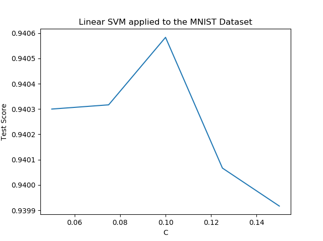
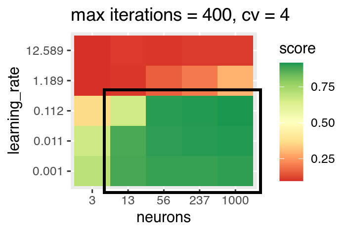
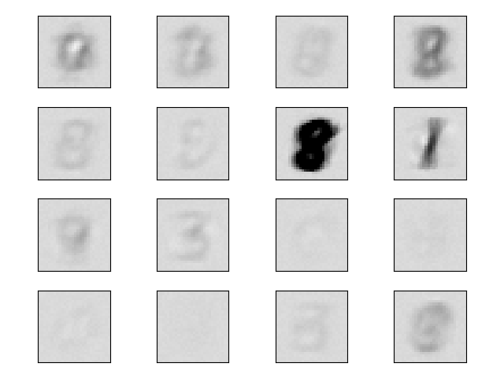
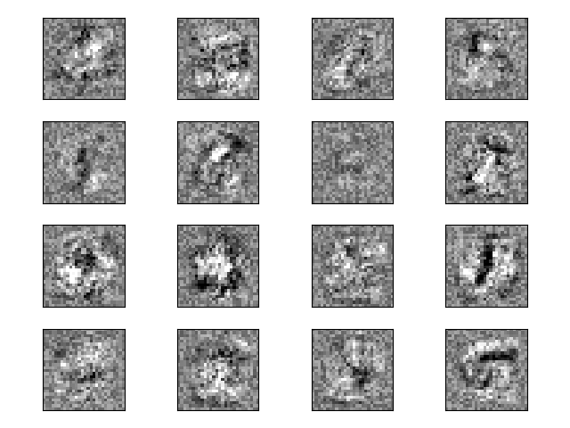
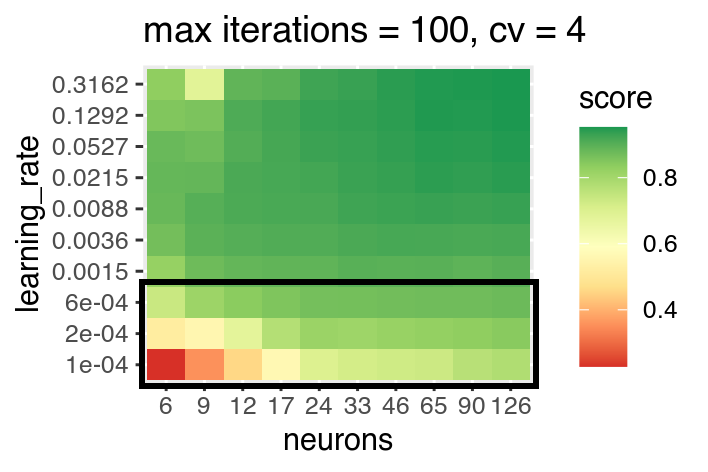
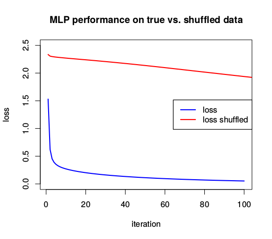
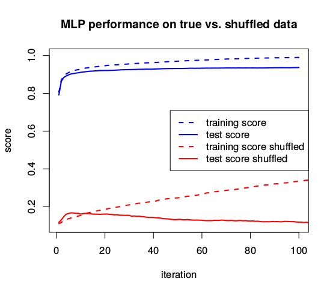
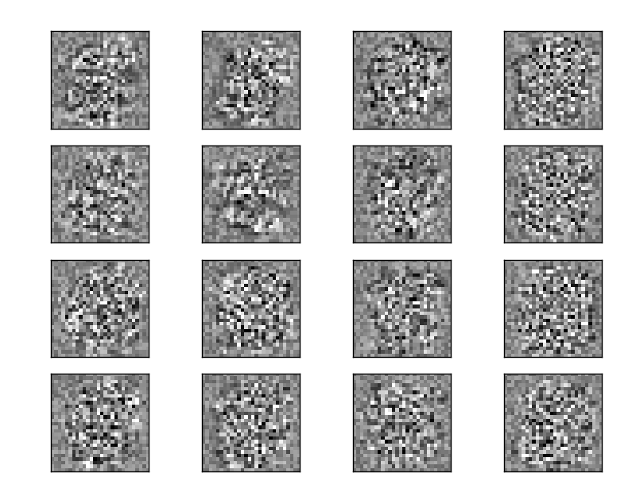
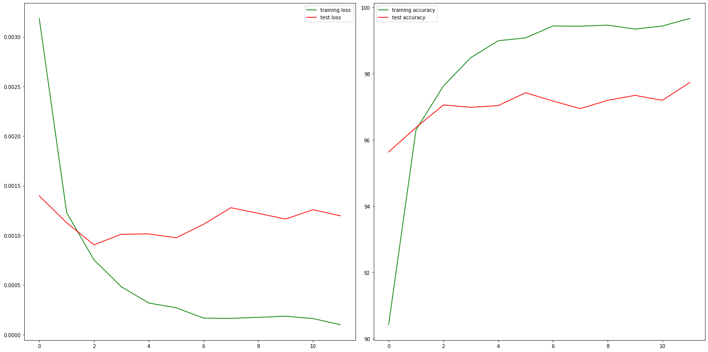

# pattern_recognition
## important notes:
- use any kind of libraries (make clear which ones, e.g. requirement.txt)
- make clear where copied code comes from
- Git: try to use branches and issues
- Due dates: 6.April: SVM, MLP; 20.April: CNN
- Work on full MNIST dataset, either csv or png format

## helpful links:
• A Simple Neural Network from Scratch with PyTorch and Google Colab: https://medium.com/dair-ai/a-simple-neural-network-from-scratch-with-pytorch-and-google-colab-c7f3830618e0

• Keras: https://keras.io/

• PyTorch tutorial: https://pytorch.org/tutorials/

## Report
## SVM
The Support Vector Machine is a discriminative classifier that tries to set up boudary hyperplanes between different classes using support vectors. The goal of this exercise was to build a SVM and apply it to the MNIST dataset, which should allow for more accurate classification compared to our last exercise using this dataset (...if properly optimized). 

The implementation of this was handled using the sklearn library, which not only contains various different versions of SVM classifiers, but also offers tools for Cross validation and more importantly; a parameter grid-search function, which we used to experimentally optimize our parameters.

### Linear Kernel
We tested our implementation with a linear Kernel and various different C's

The best C we were able to find was C = 0.1 and gave us a total test score of: 0.9472, while giving a mean accuracy value after cross validation of: 0.9405
Specially apparent here was the close correlation between the amount of training data given and the C-value that netted the best result - the more data we give the classifier, the more weigh we need to give the errors.

### RBF Kernel
We tested our implementation with a RBF Kernel and various different C's and Gamma's.

The best combination of C and Gamma we were able to find was: C = 1.5 / gamma = 0.03 and gave us a total test score of: 0.98265, while giving a mean accuracy value after cross validation of: 0.9852

Unfortunately we were unable to run the grid-search on the whole dataset, and used only 20,000 training images on a set of 2000 test images during this stage of the experiment. This will impact our final result here because we probably didn't optimally weigh the errors in our full training set of 60,000 images. 

This was done due to the absolutely unreasonable (and therefore unknown) amount of time it takes to perform a 2D grid-search on the full dataset with our implementation, by reducing the dataset we were then able to test a bunch of parameter-ranges for the final implementation on the full dataset.

## MLP: Multilayer perceptron
### Introduction
An MLP is the simplest form of a neural network. It consists of at least three layers: an input layer, one or more hidden layers, and an output layer. Each node of every layer is connected to all the other nodes in the next layer. These edges' weights can be adjusted, changing the strenght and signage of the signal they forward trough the network. Each node contains an adjustable bias, that changes the activation a node needs to propagate a signal. 

MLPs require labeled training data, meaning they learn supervised. By comparing the actual output of the network against the truth, the network adjusts the weights and biases in a way that the distance between output and truth is minimized. This process is called backpropagation.
Compared to SVMs that find the global unique optimal decision boundaries, MLPs can get stuck in local minima. The same network should thus be rerun multiple times with randomly initialized weights and biases. 

Additionally, the performance of a network is determined by the parameters learning rate (how much the system adapts the weights and biases in each step), the number of hidden neurons and hidden layers, and the alpha parameter ("penalty term", used against over/underfitting). To find the optimal parameters, a gridsearch can be applied. 
We chose to implement the MLP with the SciKit library module [`sklearn.neural_network.MLPClassifier`](https://scikit-learn.org/stable/modules/generated/sklearn.neural_network.MLPClassifier.html). For a more high level overview of the module, refer to this page: [Multi-layer Perceptron](https://scikit-learn.org/stable/modules/neural_networks_supervised.html#multi-layer-perceptron)

SciKit also offers a GridSearch Tool for a wide range of estimators, which was helpful for figuring out the best parameters for our test set: [`GirdSearchCV`](https://scikit-learn.org/stable/modules/generated/sklearn.model_selection.GridSearchCV.html#sklearn.model_selection.GridSearchCV)
  
### Learning rate and neuron count
If the learning rate is to high, the algorithm adapts to single problems really fast but does not generalize or converge. In this test with one hidden layer extremely high learning rates heve been tested. A learning rate abvove one, or a neuron count below 10 are unviable, we will focus on the parameter values marked by the black rectangle in the future. The best result in this run was achieved with `hidden_layer_sizes = 1000, learning_rate = 0.112`. The alpha was fixed at `alpha = 0.0001` for all runs. Logarithmically spaced values for neurons can easily be created with numpy: `np.rint(np.logspace(start_exponent,stop_exponent,steps)).astype('int')`. The same, just without the integer conversion, was done to create the learning rates.

As there is a trade off for more neurons (longer processing times, more chance of overfitting), we try to minimize the neuron numbers as much as possible without taking a big hit in the final score (e.g. 56 neurons). In other words: not much score improvment is gained by increasing the neuron count from 56 to 1000. 

If we peek at the first layer of weights in a sample with a way to high learning rate (`learning_rate = 3, neuron_count = 40`), we can get a an understanding of what exactly is going on. This implementation follows a [code example](https://scikit-learn.org/stable/auto_examples/neural_networks/plot_mnist_filters.html#sphx-glr-auto-examples-neural-networks-plot-mnist-filters-py) on SciKit. 

The weights adapt really fast to the latest training data, and discard/forget previous samples. In this case, the whole network seems to have been adapted to perfectly match an '8'. We can also see traces of '3's, which have not been deleted as much as other integers, as they are similar to an '8'. The final score of this network was below 25%. 

Lets compare this to a network with a better successrate (`test_set_score = 0.9406`) with a lower learning rate (`learning_rate = 0.01, neuron_count = 40`):

The weights seem to "generalize" in some way, we can detect reoccuring patterns in numbers, and even make out edge detectors: darker patterns surrounded by white borders.

What happens if we set the learning rate too low? We don't achieve an optimum within the maximum iteration steps we have set. Here is a heatmap of a gridsearch with only 100 iterations. We can see how the MLPs with low learning rates don't achieve an optimum within the given time (marked with black rectangle).

Lets try to prove that the MLP has some kind of concept about how numbers look like, and doesn't just learn the training data by heart.
By shuffling the labels, we generate nonsense data, which the MLP could still approach in the training, but where there is no way of gaining generisable knowledge of what each digit looks like. Parameters: 
`hidden_layer_sizes=40, learning_rate=.01`. 

We see that the MLP is drastically quicker in reducing loss for the true data, indicating that the MLP takes advantage of digit similarities.

By setting `warm_start=True` and `max_iter=1` we can test our MLP model against our training and test data after each iteration, which yields the following plot: 

Both the training and test scores are way higher for the correctly labeled data.
While the MLP can slowly adapt to match the shuffled training data correctly, it of coures has no way of succeding in the test set with the unseen shuffled data. 

We can further prove our point by looking at the weights of the MLP trained on the shuffled dataset.
Compared to the examples above, the weights here seem extremely unstructured, no patterns are visible.

## CNN
### Introduction
For this task we trained and tested a convolution neural network (CNN) with the full MNIST dataset. The network we create composes of three convolutional layers and one fully connected linear layer for classification.
We tryed different values for the following parameters:

batch_sizes = [50, 100, 500]
learning_rates = [0.001, 0.01, 0.1]
negative_slope of activation function:[0.01, 0.1]

We yielded the best accuracys for the testset with the lowest learning rate of 0.001. The batch size did not matter what so ever. We chose to run each model for 12 epochs. In most cases after 4-6 epochs the accuracy started to go down for the first time and then stayed at that percentage for the rest of epochs. that indicated, that our model is not overtraining with 3 convolutional layers.

We then performed the random initialization 10 times with our optimal parameters and choose the best model for the validation of the testset.
This model below achieved a accuracy of 98.37% for the testset and for the trainingset an accuracy of 99.6%.
You can see on the figure below that after 6 epochs, the accuracy of the model does not increase significantly anymore. 

## Permutated MNIST
### CNN
For this model we chose the same optimal parameters as we did for the MNIST dataset.
The figure below shows the learning curve and test accuracy on the permutated MNIST dataset.

We can see that the accuracys between the two sets do not differ greatly. 
Even though the image looks very noisy for a human, the CNN does not care about how a human recognises a image. The permutation is held constant within a session.
We think thats because it is no more easy or difficult for the CNN model to learn MNIST versus permuted MNIST as it does exploit the  spatial relationship between the pixels.

### MLP

